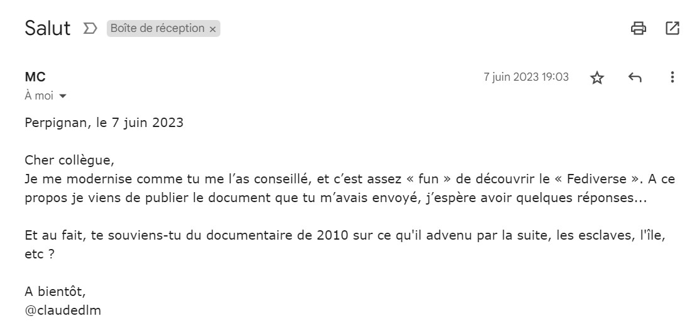
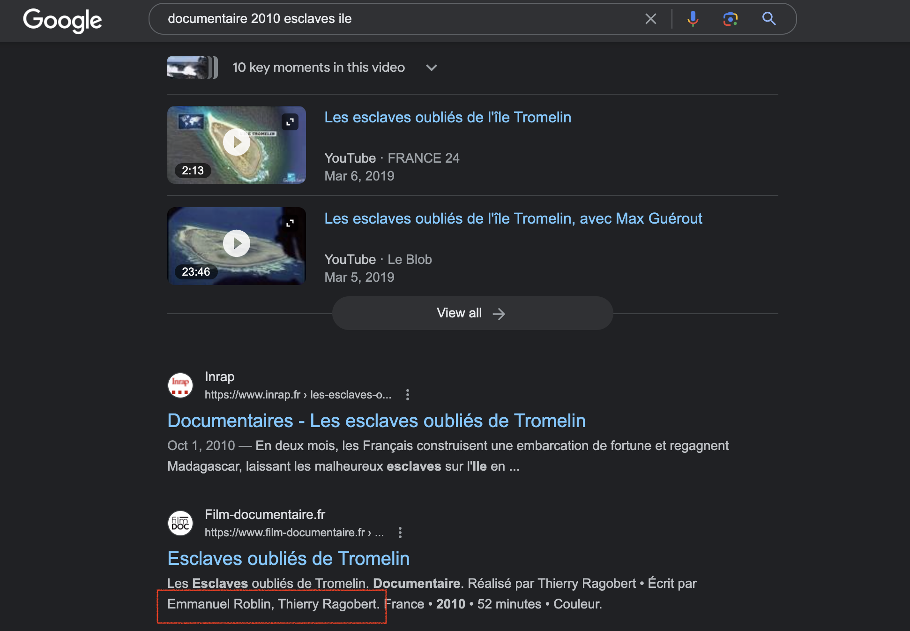
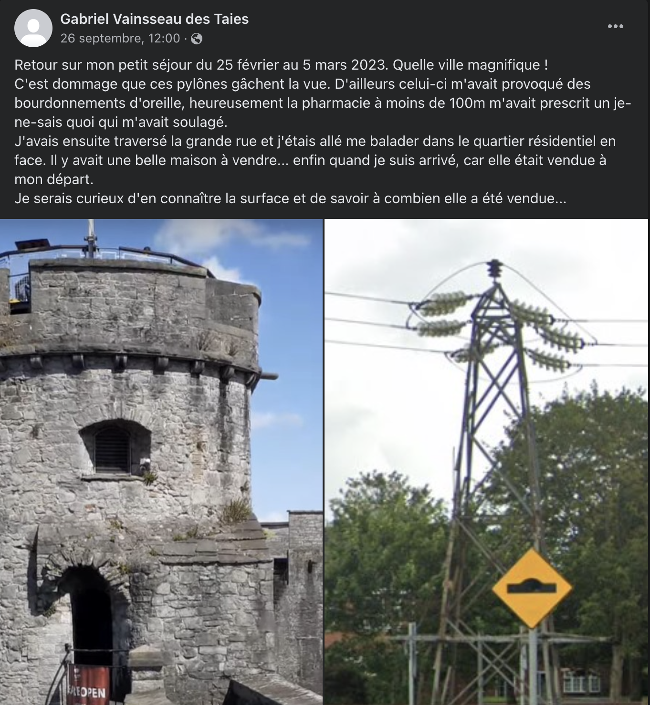
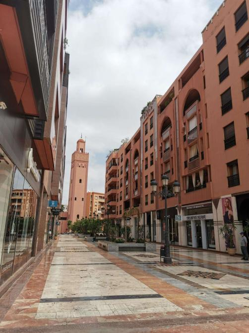
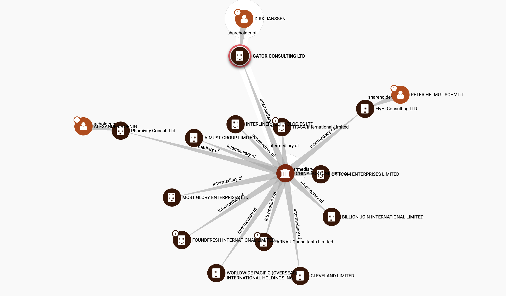

# flag4all_2023
OSINT Write-ups for the flag4all CTF (2023)

Merci à .night pour le dump ctfd :)

# OZINT.eu - La vie de Claude part 1
## Énoncé
**Category** : Osint
**Points** : 25

Qui sont les deux auteurs du documentaire ? (on demande les noms de famille dans l'ordre alphabétique)  

Format de la réponse : FLAG{dupont_durand} 

## Files : 

## Solution
En cherchant les mots clés sur google, on retrouve le nom des deux créateurs du documentaire : 

Ragobert et Robelin 

# OZINT.eu - La vie de Claude part 2
## Énoncé

**Category** : Osint
**Points** : 481

Le fils de Claude s'interroge sur un bien immobilier qu'il a vu cette année, saurez-vous répondre à ses questions ?  

Format de la réponse : FLAG{143_245800}

## Files : 

## Solution
Challenge plus compliqué
En cherchant le pseudo @claudedlm sur whatsmyname, on trouve un compte Mastodon. Sur celui-ci, il parle de Threads, qui est une fausse piste. Mais on trouve son nom complet sur une photo postée. En le cherchant sur Facebook, on trouve son profil, et une photo de son fils. Le seul like est celui de son fils, qui nous amène au profil de ce-dernier.

On y trouve les questions :

Avec google image, la première photo nous localise dans la ville de Limerick. Nous devons ensuite trouver la localisation de la deuxième photo. Au vu des indices (panneau de signalisation, poteau électrique, pharmacie à moins de 100m) on a très envie d'utiliser overpass-turbo. Après une longue bataille et des fausses pistes, je n'ai pas réussi à trouver l'endroit (j'apprendrai dans le WU officiel qu'il ne fallait pas chercher power=tower mais power=pole, les boules).

Je suis donc passé à la stratégie numéro 2 : suivre les lignes électriques dans Limerick. Celle-ci s'est avérée concluante, et j'ai pu trouver l'endroit de la prise de vue. La fin du challenge est simple, il suffit de chercher le nom de la rue dans google pour trouver l'information dont nous avons besoin :

111 et 290 000.

# Projet FOX - On The Loose
## Énoncé
**Category** : Osint
**Points** : 25

Lors d'une enquête anti-stupéfiants que vous menez, un des suspects a publié cette photo sur un de ses réseaux sociaux. 
Il indique avoir un rendez-vous commercial important dans un parc situé à proximité immédiate du lieu de prise de vue de cette photo. 

Trouvez le nom de ce parc.
Format: FLAG{Nom du Parc}

## Files : 

## Solution

Avec google image, on retrouve la localisation de la photo : Gueliz, à côté de Marrakech. Le jardin le plus proche est le Jardin 16 Novembre.

# Projet FOX - Trouble from the East
## Énoncé
**Category** : Osint
**Points** : 448

Les services de contre-espionnage ont appris que 3 pilotes de la Bundeswehr ont été recrutés par S. B., un homme d'affaires chinois et fils d'un officier de l'Armée Populaire de Libération. 
Afin d'être payés, nous savons qu'ils ont chacun établi une société écran. 
Vous avez pour tâche de retrouver l'identité de chacune de ces entreprises. 

Format du flag : FLAG{nom de l'entreprise/nom de l'entreprise/nom de l'entreprise} (par ordre alphabétique)

## Solution

En cherchant les mots clés sur google, on tombe rapidemment sur un article de ZDF mentionnant nos pilotes. Certains autres articles mentionnent le nom complet d'un des pilotes.

Ensuite, on apprend que les sociétés écrans ont été mentionnées dans l'affaire des Panama Pappers. Ces données étant Open-Source, on peut trouver un des pilote et sa société. Celle-ci est reliée à une société chinoise. En dépliant l'arbre, on trouve les deux autres sociétés qui nous interessent :

FlyHi Consulting LTD/GATOR CONSULTING LTD/Phamivity Consult ltd

# OSINT-FR - SCOTT
## Énoncé
**Category** : Osint
**Points** : 484

En 1971, lors d'une mission, Scott à déposé un papier à ces coordonnées 25°57'56.9"N 3°34'56.4"E!
Sur ce papier figure une date.

Quel sont les 3 mots inscrits sous cette date ?
exemple : Vive Les CTF 
          FLAG{Vive_Les_CTF}

## Solution

Malgré la très forte envie d'exploiter les coordonnées, il faut bien utiliser la date et le prénom dans un premier temps. La personne concernée est David Scott, un astronaute de la mission Apollo 15. Le plus rapide ensuite était d'utiliser google Earth en mode lune et rentrer les coordonnées.

Personnellement, j'ai cherché ce qu'aurait pu déposer Scott, dans l'ordre :
- Une bible, mais impossible de trouver une image
- Une enveloppe, avec le scandale des lettres postales. Mais pas de date non plus.
- Après un certain temps, j'ai trouvé l'histoire de l'étiquette de la cuvée de Nuits Saint Georges.

Une fois cette information en poche, on trouve une image, avec le texte **Cuvée Terre Lune** sous la date.

# OSINT-FR - Georgette
## Énoncé 
**Category** : Osint
**Points** : 448

Nous somme en JUILLET 2021.
Georgette a fait ses courses dans le magasin Tutti Fruti à Sèvres.
En rentrant chez elle, elle découvre avec stupéfaction qu'une des bananes qu'elle a achetée est toute verte à l'intérieur.
Elle veut absolument se plaindre auprès du magasin.
Elle essaie d'appeler plusieurs fois au numéro qu'elle trouve sur LE internet. Mais personne ne répond.
Elle envoie un mail trouvé sur leur site Oueb, mais personne ne répond.
Elle est désespérée. 
Elle fait appel à son petit fils ( VOUS ) pour trouver une adresse mail sur laquelle elle pourrait contacter le responsable du magasin.
Georgette vous demande d'effectuer vos recherches en respectant la loi française.

Quelle est cette adresse mail ?

FLAG{adresse@mail.com}

## Solution

Je n'ai pas réussi ce challenge (malgré l'indice)
Il fallait utiliser le site officiel des commerces de la ville de Sèvres et croiser avec la Wayback machine pour retrouver l'adresse mail.